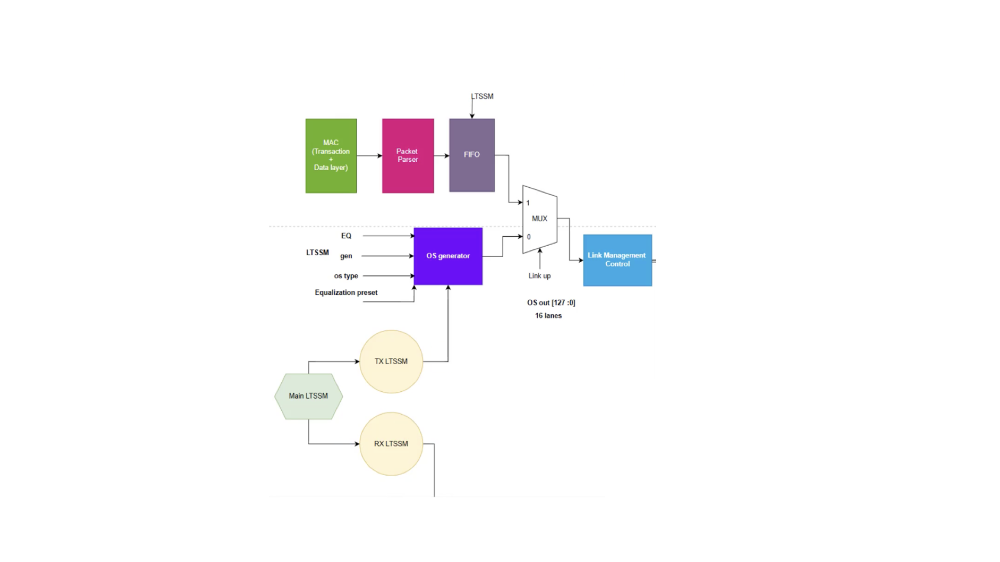

# PCIe Controller — Verilog

A PCIe controller implemented in SystemVerilog, covering ordered set generation, TX/RX link training state machines, and physical-layer packet parsing.

---

## Schematic

---

## Ordered Set Generator

Design and Verilog implementation of an Ordered Set Generator, including TS1/TS2 generation logic for use during link training.

---

## TX-Side LTSSM

RTL construction of the transmit-side Link Training and Status State Machine, with complete state sequencing and training-pattern emission across all relevant LTSSM states.

---

## RX-Side LTSSM

RTL construction of the receive-side LTSSM, including:

- **Detect** — physical receiver detection logic
- **Polling** — bit-lock and symbol-lock acquisition
- **Configuration** — lane and link width negotiation
- **Ordered Sequence Parsing** — recognition and handling of incoming TS1/TS2 ordered sets

---

## RX Packet Parser

A Verilog RX Packet Parser to decode incoming symbols, identify Ordered Sets, and determine physical-layer packet boundaries.
